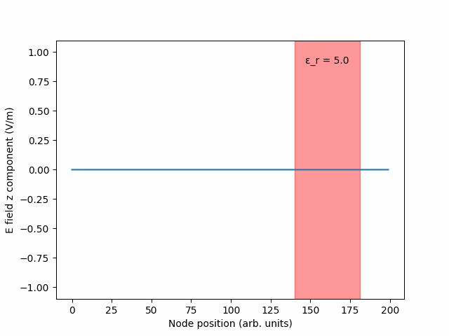

Finite difference time domain simulation of Maxwell's equations

## Outline

Sends a Gaussian pulse towards a region of dielectric constant != 1. Supports only a constant permittivity in this region.

